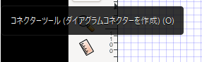
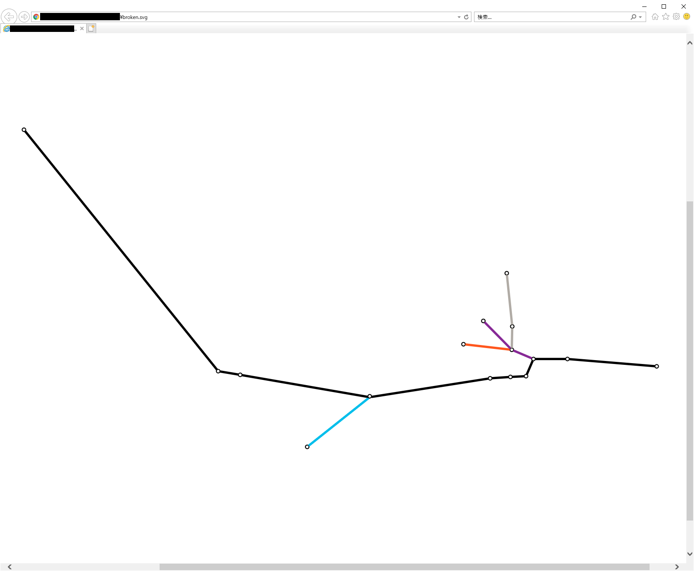
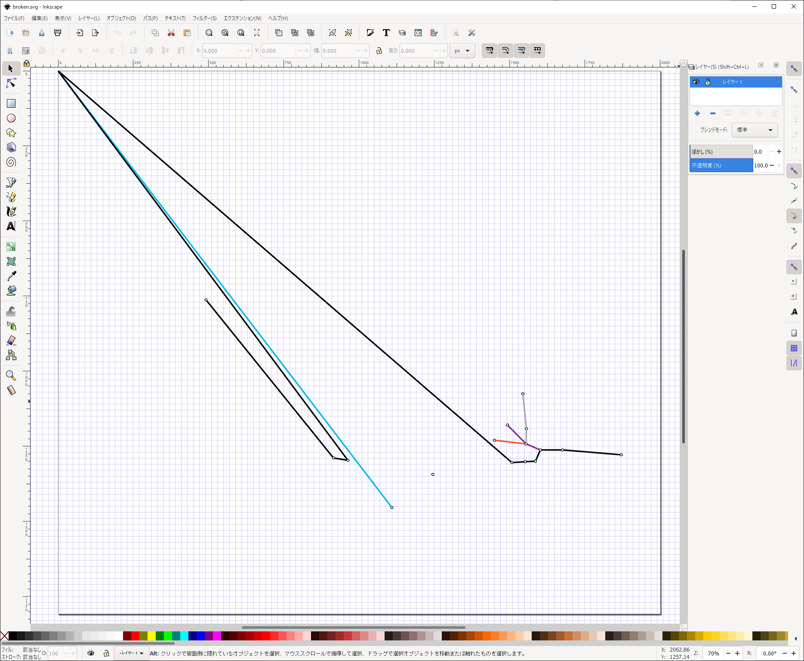

# 問題点・知りたいこと

Inkscape でコネクタツール機能を使って、オブジェクト間の接続関係を表す図を作成しているのですが、  
作成した svg を保存してから、再度 Inkscape で開き直すと、  
コネクタの接続先が、接続先オブジェクトではなく画面左上を指してしまうことがあります。  

なぜこのような表示になってしまうのか(なにか操作が間違っているのか等)、  
また、これを避けるには、どのようにしたらよいのかアドバイス頂きたく、宜しくお願いします。  

# 問題が発生した例

矩形ツールや円ツールでオブジェクトを配置したあとに、オブジェクト間をコネクタツールで接続します。  

コネクタツールは、Inkscape 画面左側のコネクタツール(下図)を使っています。  
  

目的の図が作成できたら、保存して Inkscape を閉じます。(ファイルを [broken.svg]//todo に保存しました)  
できた .svg ファイルを ie11 で開くと、Inkscape で作成したとおりに表示できている事が確認できます。  

↓ ie で表示した場合。正しく期待通りのコネクタが描画されている。  
↓ (chrome など他のブラウザでも同様です)
  

このファイルを再度 Inkscape で開くと、コネクタの接続先が画面左端を指してしまうオブジェクトがある。
(オブジェクト自体の位置は正しい位置だけど、コネクタの接続先が画面左上になってしまう)  

↓ Inkscape(ver1.0) で開いたとき。  
↓ 一部オブジェクトに対するコネクタ接続先が画面左上を指してしまう。
  

# 環境
 - Inkscape ver1.0 (ver0.92 でも同様の事が起こる事があるのを確認しました)
 - IE ver11
